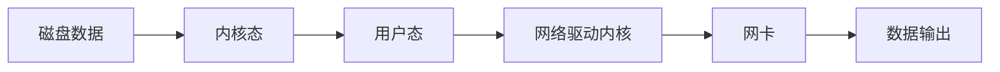
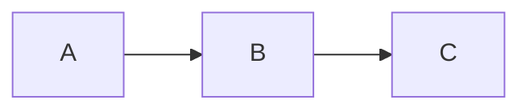

# 消息存储

分布式队列因为有高可靠性的要求，所以数据要进行持久化存储。

工作流程如下：

```sequence
Producer->MQ: 发送消息
MQ->存储系统: 存储消息
MQ->Producer: ACK确认
MQ->Consumer: 消息发送
Consumer->MQ: ACK确认
MQ->存储系统: 删除消息
```

## 存储介质

关系型数据库存储：

apache下开源的另外一款MQ——ActiveMQ（默认采用KahaDB做消息存储）可以选用JDBC的方式来做消息持久化，通过简单的xml配置即可实现JDBC消息存储。由于普通关系型数据库在单表数据量达到千万级别的情况下，其IO读写性能往往会出现瓶颈。在可靠性方面，这种方案非常依赖DB，如果一旦DB出现故障，则MQ的消息就无法落盘存储，就会导致线上故障。


文件系统存储：

目前业界较为常用的几款MQ（RocketMQ/Kafaka/RabbitMQ）均采用的是消息刷盘至所部署虚拟机/物理机的文件系统来做持久化（刷盘一般可以分为异步刷盘和同步刷盘两种模式）。消息刷盘为消息存储提供了一种高效率、高可靠性和高性能的数据持久化方式。除非部署MQ机器本身或是本地磁盘挂了，否则一般是不会出现无法持久化的故障问题。


## 存储和发送的性能

存储：

磁盘如果使用得当，磁盘的速度完全可以匹配上网络的数据传输速度。目前的高性能磁盘顺序读写速度超过了一般网卡的传输速度，但磁盘的随机写速度和顺序写性能差很多。

RocketMQ的消息用顺序写，保证了消息存储的速度。


发送：

Linux操作系统分为用户态和内核态，文件操作、网络操作需要涉及这两种形态的切换，免不了进行数据复制。

一台服务器把本机磁盘文件的内容发送到客户端，一般分为两个步骤：

1. read：读取本地文件内容
2. write：将读取的内容通过网络发送出去。

这两个操作实际进行了4次数据复制：

1. 将磁盘复制数据到内核态内存
2. 从内核态内存复制到用户态内存
3. 然后从内核态内存复制到网络驱动的内核态内存
4. 从网络驱动的内核态内存复制到网卡中进行传输

如图：





通过使用 mmap 的方式，可以省去向用户态的内存复制，提高速度。即内核态直接复制都网络驱动内核中。这种机制在 java 中通过 MappedByteBuffer实现的。

RocketMQ 利用了上述特性，也就是所谓的“零拷贝”技术，提高消息存盘和网络发送的速度。

> 采用MappedByteBuffer这种内存映射的方式有几个限制，其中之一是一次只能映射1.5-2G的文件至用户态的虚拟内存，这也是RocketMQ默认设置单个CommitLog日志数据文件为1G的原因。
>
> ```properties
> # broker配置文件中commitLog每个文件的默认大小1g
> mapedFileSizeCommitLog=1073741824
> # commitLog存储路径
> storePathCommitLog=/home/rocketmq/data_a/store/commitlog
> ```


## 消息存储结构

RocketMQ消息的存储是由ConsumeQueue和CommitLog配合完成的，消息真正的物理存储文件是CommitLog。ConsumeQueue是消息的逻辑队列，类似数据库的索引文件，存储的是指向物理存储的地址。每个Topic下的每个MessageQueue都有一个对应的ConsumeQueue文件。

broker配置的相关的存储路径：

```properties
# 存储路径
storePathRootDir=/home/rocketmq/data_a/store
# commitLog存储路径
storePathCommitLog=/home/rocketmq/data_a/store/commitlog
# 消费队列存储路径
storePathConsumeQueue=/home/rocketmq/data_a/store/consumequeue
# 消息索引存储路径
storePathIndex=/home/rocketmq/data_a/store/index
# checkpoint文件存储路径
storeCheckpoint=/home/rocketmq/data_a/store/checkpoint
# abort文件存储路径
abortFile=/home/rocketmq/data_a/store/abort
```

- commitLog

  >  存储消息的元数据（Topic、QueueId、Message）。
  >
  > 创建的CommitLog文件夹中，创建的文件从 00000000000000000000 开始编号，创建出来就是1G，存满之后再创建下一个编号的。

- ConsumerQueue

  > 消费逻辑队列，存储消息在CommitLog的索引。
  >
  > 消费者从ConsumerQueue获取到消息在CommitLog上的索引，然后再到CommitLog指定位置获取消息。
  >
  > 在CommitLog上也存储着ConsumerQueue，如果ConsumerQueue损坏丢失，可以通过CommitLog恢复还原出来。

- IndexFile

  > 索引文件。
  >
  > 为了消息查询提供了一种通过key或时间区间来查询消息的方法，这种通过IndexFile来查找消息的方法不影响发送与消费消息的主流程。


## 刷盘机制

RocketMQ的消息时存储到磁盘上的， 这样既能保证断电后恢复，又可以让存储的消息量超过内存的限制。RocketMQ为了提高性能，会尽可能地保证磁盘的顺序写。消息在通过Producer写入RocketMQ的时候，有两种写磁盘方式：分布式同步刷盘和异步刷盘。


在Broker的配置文件中进行选择需要的刷盘方式：

```properties
# ASYNC_FLUSH 异步刷盘
# SYNC_FLUSH 同步刷盘
flushDiskType=ASYNC_FLUSH
```


同步刷盘：

在返回写成功状态的时候，消息已经被写入磁盘。具体流程是：消息写入内存的PageCache后，立刻通知刷盘线程刷盘，然后等待刷盘完成，刷盘线程执行完成后唤醒等待的线程，返回消息写成功的状态。

```sequence
Producer->Java Heap: 发送数据
Java Heap-> Memory: 发送数据
Memory->disk: flush
note right of disk: 刷盘
disk->Memory: success
Memory->Java Heap: 响应
Java Heap->Producer: success
```


异步刷盘：

在返回写成功状态时，消息可能只是被写入了内存的PageCache，写操作的返回快，吞吐量大；当内存里的消息量积累到一定程度时，统一触发写磁盘动作，快速写入。

```sequence
Producer->Java Heap: 发送数据
Java Heap-> Memory: 发送数据
Memory->Java Heap: 响应
Java Heap->Producer: success
Memory->disk: 新开线程通知刷盘
note right of disk: 刷盘
```

# 高可用机制

RocketMQ分布式集群是通过Master和Slave的配合达到高可用性的。

Master和Slave的区别：在Broker的配置文件中，参数Broker的值为0表名这个Broker是Master，大于0表明这个Broker是Slave。同时BrokerRole参数也会说明这个Broker是Master还是Slave。

```properties
brokerName=broker-a
brokerId=0
brokerRole=SYNC_MASTER
```

Master角色的Broker支持读和写，Slave角色的Broker仅支持读，也就是Producer只能和Master角色的Broker连接写入消息。

Consumer可以连接Master角色的Broker，也可以连接Slave角色的Broker来读取消息。

## 消息消费高可用

在Consumer的配置文件中，并不需要设置是从Master读还是从Slave读，当Master不可用或者繁忙的时候，Consumer会被自动切换到从Slave读。有了自动切换Consumer这种机制，当一个master角色的机器出现故障后，Consumer仍然可以从Slave读取消息，不影响Consumer程序，这就达到了消费端的高可用性。

## 消息发送高可用

在创建Topic的时候，把Topic的多个Message Queue创建在多个Broker组上（相同Broker名称，不同BrokerID的机器组成一个Broker组），这样当一个Broker组的Master不可用后，其他组的Master仍然可用，Producer仍然可以发送消息。

RocketMQ目前还不支持把Slave自动转换成Master，如果机器资源不足，需要把Slave转换成Master，则要手动停止Slave角色的Broker，更改配置文件，用新的配置文件启动Broker。


## 消息主从复制

如果一个Broker组有Master和Slavew，消息需要从Master复制到Slave上，有同步复制和异步复制两种复制方式。


同步复制：

同步复制时等Master和Slave均写成功之后才反馈给客户端写成功状态。

在同步复制方式下，如果Master出现故障，Slave上有全部的备份数据，容易恢复，但同步复制会增大数据写入延迟，降低系统吞吐量。


异步复制：

异步复制方式是只要Master写成功即可反馈给客户端写成功状态。

在异步复制方式下，系统拥有较低的延迟和较高的吞吐量，但是如果Master出了故障，有些数据因为没有被写入Slave，有可能会丢失。


配置：

同步复制和异步复制时通过Broker配置文件里的brokerRole参数进行设置的，这个参数可以被设置成 ASYNC_MASTER、SYNC_MASTER、SLAVE三个值中的一个。

```properties
brokerRole=SYNC_MASTER
```


实际应用中，要结合业务场景合理设置刷盘机制和主从复制方式。尤其是SYNC_FLUSH方式由于频繁地触发磁盘写动作，会明显降低性能。

通常情况下，应该把Master和Slave配置成 ASYNC_FLUSH的刷盘方式，主从之间配置成 SYNC_MASTER 的复制方式，这样即使有一台机器出现故障，仍然能保证数据不丢失。


# 负载均衡

## Producer负载均衡

Producer端，每个实例在发消息的时候，默认会轮询所有的message queue发送，以达到让消息平均落在不同的queue上，而由于queue可以散落在不同的Broker，所以消息就发送到不同的Broker下。

Producer的负载均衡在RocketMQ服务端已经实现了，不需要用户再做处理。


## Consumer负载均衡

### 集群模式

在集群消费模式下，每条消息只需要投递到订阅这个Topic的Consumer Group下的一个实例即可。RocketMQ采用主动拉取的方式拉取并消费消息，在拉取的时候需要明确指定拉取哪一条Message Queue。

而每当实例的数量有变更，都会触发一次所有实例的负载均衡，这时候会按照queue的数量和实例的数量平均分配queue给每个实例。

负载均衡在RocketMQ的服务端已经实现，用户只需要启动多个消费者即可。

默认的分配算法是 AllocateMessageQueueAveragely。

还有一种平均算法是 AllocateMessageQueueAveragelyByCircle，也是消费者平均分摊每一条queue，只是以环状轮流分queue的形式。消费者分配到的几个queue分别位于不同的Broker上。


集群模式下，一个消费者能拿到多个queue，但是一个queue都是只允许分配给一个消费者实例。如果多个实例同时消费一个queue的消息，由于拉取哪些消息时consumer主动控制的，那样会导致同一个消息在不同的实例下被消费多次，所以算法上都是一个queue只分配给一个consumer实例、

通过增加Consumer实例去分摊queue的消费，可以起到水平扩展的消费能力的作用。而有实例下线的时候，会重新触发负载均衡，这时候原来分配到的queue将分配到其他实例上继续消费。

但是如果consumer实例的数量比message queue的总数量还多的话，多出来的consumer实例将无法分到queue，也就无法消费到消息，也就无法起到分摊负载的作用了。所以需要控制让queue的总数量大于等于consumer的数量。


### 广播模式

由于广播模式下要求一条消息需要投递到一个消费组下面所有的消费者实例，所以也就没有消息被分摊消费的说法。

在实现上，其中一个不同就是在consumer分配queue的时候，所有consumer都分到所有的queue。


# 消息重试

## 顺序消息的重试

对于顺序消息，当消费者消费消息失败后，消息队列RocketMQ会自动不断进行消息重试（每次间隔时间1秒），这时应用会出现消息消费被阻塞的情况。因此，在使用顺序消息时，无比保证应用能够及时监控并处理消费失败的情况，避免阻塞现象的发生。


## 无序消息的重试

对于无序消息（普通消息、定时消息、延时消息、事务消息），当消费者消费消息失败时，可以通过设置返回状态达到消息重试的结果。

无序消息的重试只针对集群消费方式生效。广播方式不提供失败重试特性，即消费失败后，失败消息不再重试，继续消费新的消息。


RocketMQ默认允许每条消息最多重试16次，每次重试的间隔时间如下：

| 重试次数 | 与上次重试的间隔时间 | 重试次数 | 与上次重试的间隔时间 |
| -------- | -------------------- | -------- | -------------------- |
| 1        | 10秒                 | 9        | 7分钟                |
| 2        | 30秒                 | 10       | 8分钟                |
| 3        | 1分钟                | 11       | 9分钟                |
| 4        | 2分钟                | 12       | 10分钟               |
| 5        | 3分钟                | 13       | 20分钟               |
| 6        | 4分钟                | 14       | 30分钟               |
| 7        | 5分钟                | 15       | 1小时                |
| 8        | 6分钟                | 16       | 2小时                |

如果消息重试16次之后仍然失败，消息将不再投递，进入死信队列。如果严格按照上述重试时间间隔计算，某条消息在一直消费失败的前提下，将会在接下来的4小时46分钟之内进行16次重试，超过这个时间范围消息将不再重试投递。

> 一条消息无论重试多少次，这些重试消息的Message ID不会改变


消费失败后，重试的配置方式：

集群消费方式下，消费消息失败后期望消息重试，需要在消息监听器接口的实现中明确进行配置（三种方式任选一种）：

- 返回 Action.ReconsumeLater （推荐）
- 返回 null
- 抛出异常

```java
public class MessageListenerImpl implements MessageListener {
    @Override
    public Action consume(Message message, ConsumeContext context) {
        // 处理消息
        doConsumeMessage(message);
        
        // 返回重试
        return Action.ReconsumeLater;
    }
}
```


消费失败后不需要重试，配置方式：

返回 Action.CommitMessage

```java
public class MessageListenerImpl implements MessageListener {
    @Override
    public Action consume(Message message, ConsumeContext context) {
       try{
            // 处理消息
            doConsumeMessage(message);
       } catch(Throwable e) {
           return Action.CommitMessage;
       }
        return Action.CommitMessage;
    }
}
```


自定义能够以消息最大重试次数：

RocketMQ允许Consumer启动时候设置最大重试次数，重试时间间隔将按照如下策略：

- 最大重试次数小于等于16次，则重试时间按照默认的
- 最大重试次数大于16次，超过16次的重试时间间隔均为每次2小时

```java
Properties properties = new Properties();
// 设置最大消息重试次数20次
properties.put(PropertyKeyConst.MaxReconsumeTimes, "20");
Consumer consumer = ONSFactory.createConsumer(properties);
```

注意：

- 消息最大重试次数的设置 对相同 GroupID 下的所有Consumer实例有效
- 如果只对相同GroupID下两个Consumer实例中的其中一个设置了MaxReconsumeTimes，那么该配置对两个Consumer实例均生效
- 配置采用覆盖的方式生效，即最后启动的Consumer实例会覆盖之前的启动实例的配置


获取消息重试次数：

```java
public class MessageListenerImpl implements MessageListener {
    @Override
    public Action consume(Message message, ConsumeContext context) {
        // 获取消息的重试次数
       System.out.println(message.getReconsumeTimes());
       return Action.CommitMessage;
    }
}
```


# 死信队列

当一条消息初次消费失败，消息队列会自动进行消息重试。达到最大重试次数后，若消费依然失败，则表明消费者在正常情况下无法正确地消费该消息，此时RocketMQ不会立刻将消息丢弃，而是将其发送到该消费者对应的特殊队列中。

在RocketMQ中，这种正常情况下无法被消费的消息称为死信消息（Dead-Letter Message），存储死信消息的特殊队列称为死信队列（Dead-Letter Queue）。


死信消息特征：

- 不会再被消费者正常消费
- 有效期与正常消息相同，均为3天。3天后会被自动删除。


死信队列的特征：

- 一个死信队列对应一个GroupID，而不是对应单个消费者实例
- 如果一个GroupID未产生死信消息，RocketMQ不会为其创建相应的死信队列
- 一个死信队列包含了对应GroupID产生的所有死信消息，不论该消息属于哪个Topic


死信消息处理：

可以在RocketMQ控制台 --> 主题 查看死信队列。

在排查并解决问题后，可以在RocketMQ控制条重新发送该消息，让消费者再重新消费一次。


# 消息幂等

RocketMQ消费者在接收到消息后，有必要根据业务上的唯一key对消息做幂等处理。


处理方式：

因为Message ID有可能出现冲突（重复）的情况，所以真正安全的幂等处理不建议用MessageID作处理依据。最好是以业务唯一标识作为幂等处理的关键依据，而业务的唯一标识可以通过消息key进行设置：

```java
Message message = new Message();
message.setKey("ORDERID_100");
SendResult result = producer.send(message);
```

订阅方收到消息时可以根据消息的key进行幂等处理：

```java
consumer.subscribe("ons_test", "*", new MessageListener() {
  public Action consume(Message message, ConsumeContext context) {
      String key = message.getKey();
      // 根据业务唯一标识的key做幂等处理
  }  
});
```

